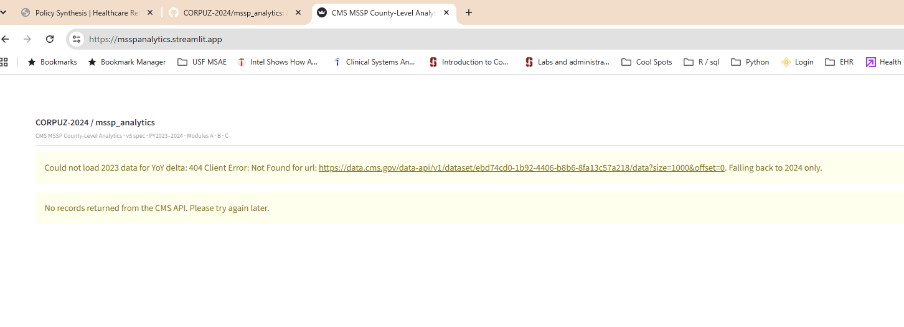

# Architecture

Operational and design notes for the MSSP Analytics pipeline. This folder holds detail
that would otherwise crowd the top-level [`README.md`](../README.md); that file carries
the overview.

## Original failure modes

The dashboard previously queried the CMS Data API from the browser on every page load,
which made a third-party API a hard runtime dependency of the page. It failed in two
ways at once, and only one of them produced a visible error:



1. **Retired UUIDs.** Year-specific dataset UUIDs were hard-coded. CMS retired them, so
   requests returned `404 Access denied to the requested data`.
2. **A silent content swap.** The "portal default" UUID is an alias for the newest
   vintage, not a fixed year. When CMS published PY2025 that UUID began serving
   `YEAR=2025`, so a `start_year=2024, end_year=2024` filter matched nothing — no HTTP
   error, only an empty dashboard.

## Build-time data flow

All CMS access now happens at build time, in CI, and the result is committed:

```
data.cms.gov/data.json ──▶ src/etl/catalog.py   title ──▶ current dataset UUIDs
data.cms.gov/data-api  ──▶ src/etl/client.py    fetch, paginate, wide──▶long, verify year
                           src/etl/{ingest,enrich}.py   normalise, coerce, flag
                           src/build_site.py    YoY + OC deltas, quality gates, atomic publish
                                  │
                                  ▼  (committed to git by CI)
                           docs/data/*.json   counties · oc_stability · reference · manifest
                                  │
                                  ▼  (static fetch, no API)
                           docs/index.html + docs/app.js  ──▶  GitHub Pages
```

The published page reads committed JSON and nothing else. A CMS outage, URL change or
schema change can fail a build; it cannot blank the page, which keeps serving the last
payload that passed the quality gates.

## Upstream-failure guards

| Guard | Where | Purpose |
|---|---|---|
| Title-keyed catalog resolution | [`src/etl/catalog.py`](../src/etl/catalog.py) | Absorbs UUID rotation. The dataset title in `data.cms.gov/data.json` is the stable key; UUIDs are read from it per build. |
| Year discovery | `catalog.latest_years()` | Prevents pinned years going stale — years come from the catalog, never a constant. |
| Year assertion | `client._assert_expected_year()` | Catches the silent swap. If CMS serves a different year than was resolved, the build fails loudly instead of returning zero rows. |
| Quality gates + atomic publish | `build_site.run_quality_gates()`, `publish()` | Prevents a degraded payload replacing a good one. Data is staged to a temporary directory, validated, then swapped in; a failed gate leaves `docs/data/` untouched. |
| Committed catalog cache | [`data/cms_catalog.json`](../data/cms_catalog.json) | Covers a CMS outage during a build — the resolver falls back to the last known-good endpoint map instead of failing. |

Quality-gate thresholds, defined in [`src/build_site.py`](../src/build_site.py): at least
8,000 county rows, at least 45 states, at least 75% non-null `avg_risk_score` /
`per_capita_exp` on the latest year, at least 50% YoY-delta coverage, and all four
enrollment types present.

## Operational-cut data

The catalog exposes the operational cuts (`OC1` / `OC2` / `OC3`) alongside each `FINAL`
vintage. The OC-stability panel — earliest-cut → `FINAL` risk-score movement per county,
a read on late diagnosis coding — is therefore backed by real vintages. The earlier
single-cut fetch could only render it as a hard-coded illustration.
